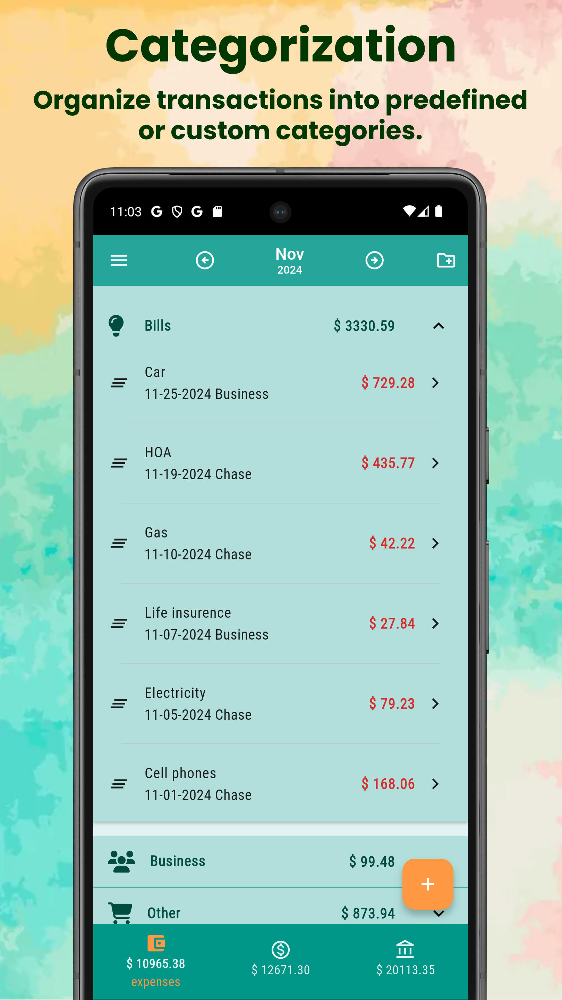
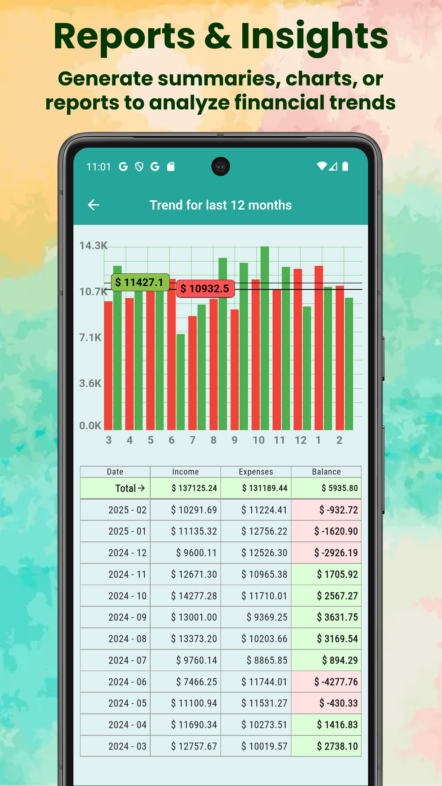
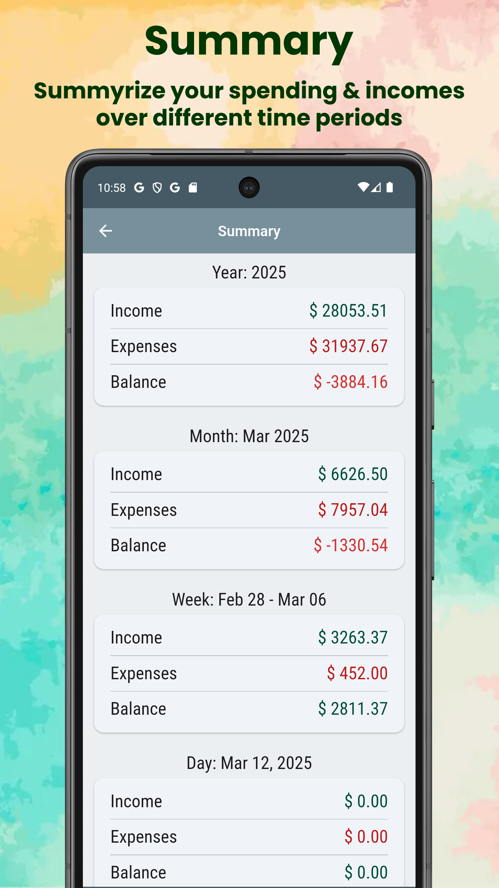
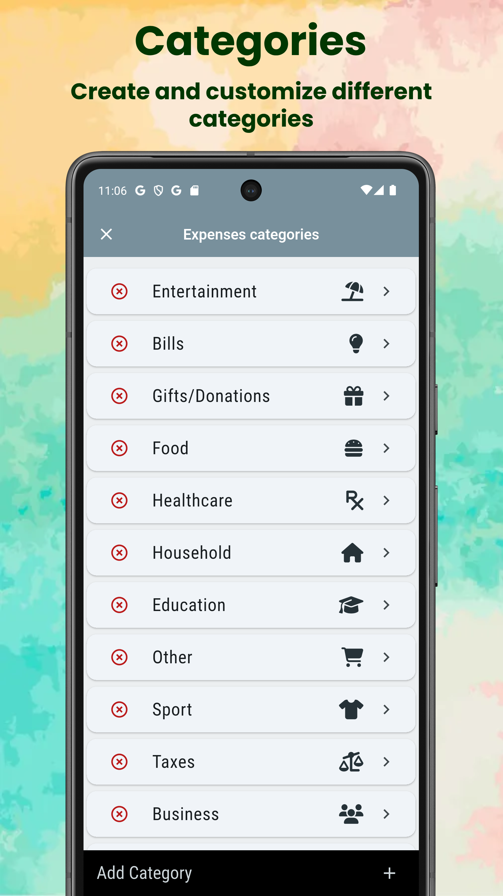
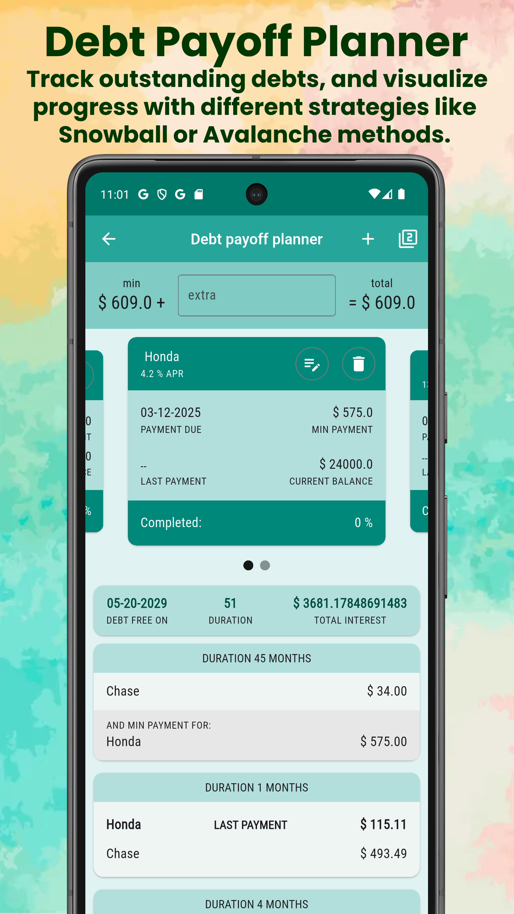
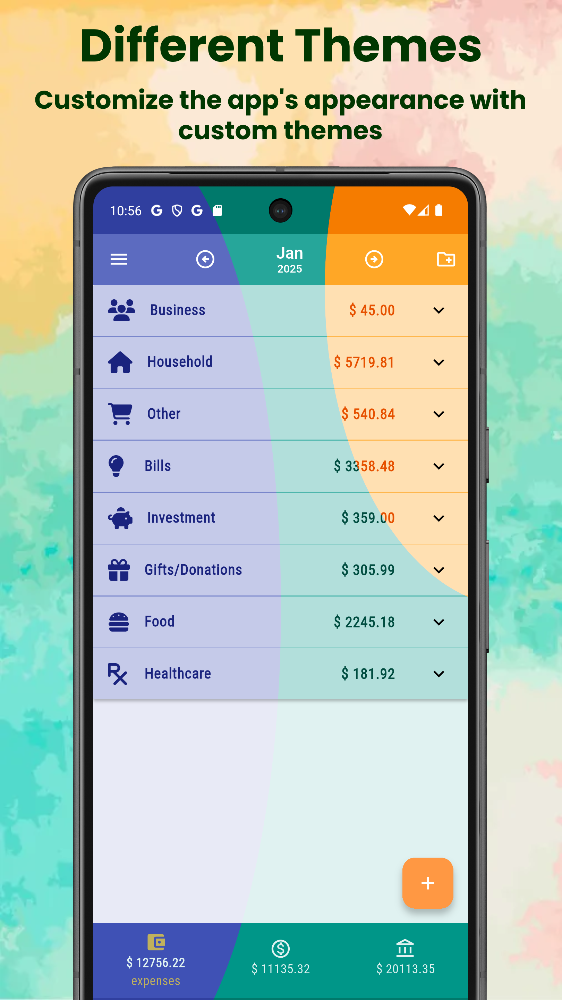
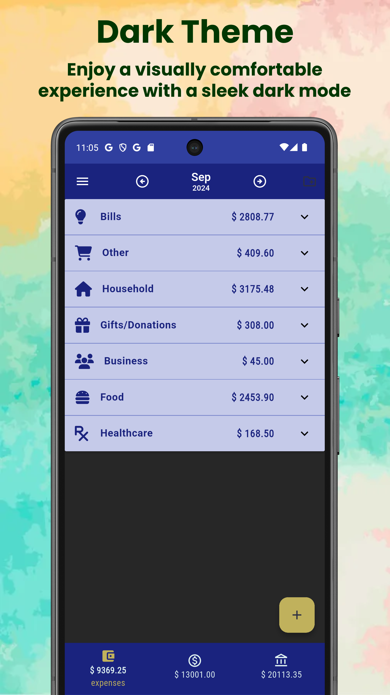

# Qruto Budget
Qruto Budget is a powerful yet easy-to-use personal finance app designed to help you take full control of your money. Built with Flutter for a smooth experience across devices, Qruto makes budgeting simple, convenient, and even a little fun.

Key features include:

✅ Intuitive interface that makes tracking your income and expenses effortless

💡 Debt Payoff Planner to calculate optimal strategies for eliminating debt using the Snowball or Avalanche method

📂 Transactions organized by categories and accounts for better clarity and structure

📊 Simple charts to visualize your spending habits and financial trends

☁️ Google Drive backup support to keep your data safe and synced across devices

Whether you're budgeting for a vacation, tracking your daily coffee spending, or getting out of debt — Qruto Budget is built to guide you every step of the way.

  
  

  
  
  
  
  
  
  

