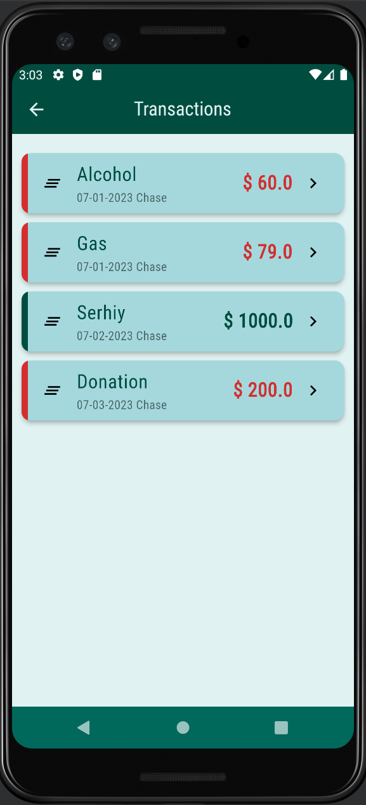
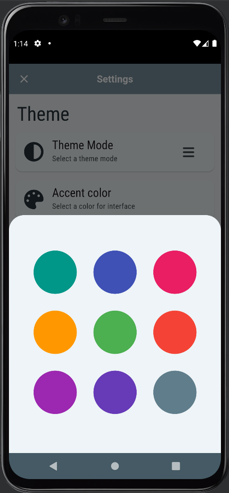
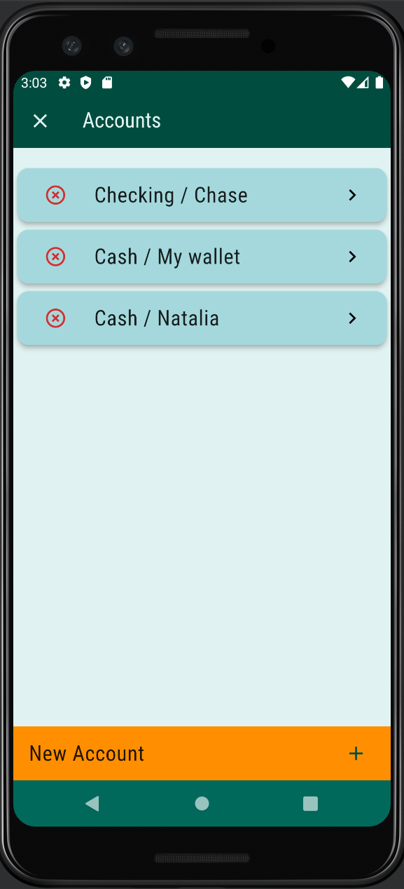
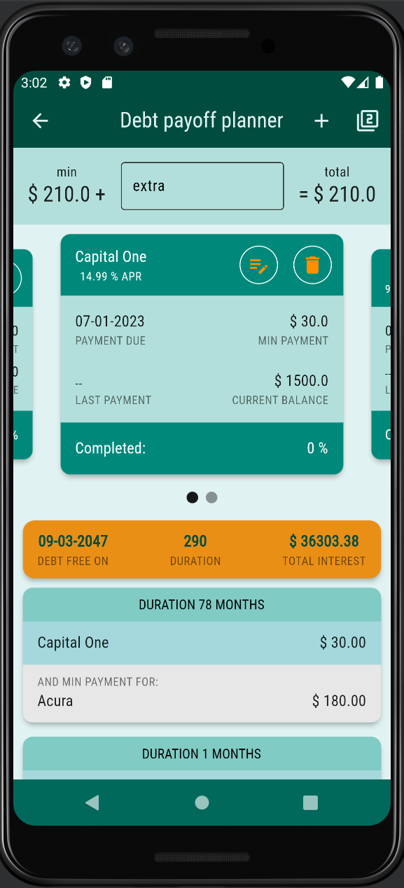

# Qruto budget

  

Qruto Budget stands as a comprehensive, feature-packed application 
crafted to empower users in efficiently managing their finances. 
Developed with Flutter, this app provides a smooth and user-friendly 
experience across multiple platforms. The back-end (Java) is available [here](https://github.com/mrlanu/budget-app-back).

    
    
    
    
    
    
    
    
    
    

